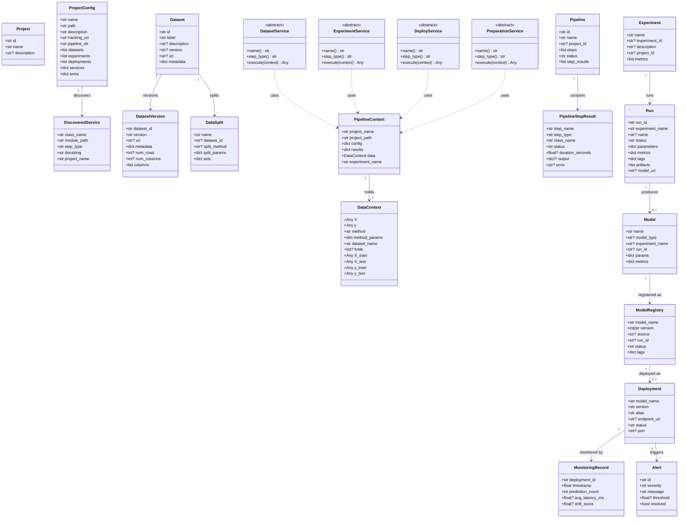

# mllab Domain Entities

This package contains all domain model classes (dataclasses) and pipeline abstract base classes used throughout the mllab platform.

---

## Entity Classes

### Project & Discovery

| Class | File | Description |
|-------|------|-------------|
| `Project` | `project.py` | Lightweight project reference (id, name, description). |
| `ProjectConfig` | `project_config.py` | Full parsed configuration from `mllab.yaml` including datasets, experiments, deployments, and service metadata. |
| `DiscoveredService` | `discovered_service.py` | Metadata about an autodiscovered pipeline service class (class name, module path, step type). |

### Data & Datasets

| Class | File | Description |
|-------|------|-------------|
| `Dataset` | `dataset.py` | A registered dataset with label, version, URI, and metadata. |
| `DatasetVersion` | `dataset_version.py` | A specific version of a dataset including schema info (rows, columns). |
| `DataSplit` | `data_split.py` | A named split strategy applied to a dataset (e.g. kfold, train_test). |
| `DataContext` | `data_context.py` | Runtime data container passed between pipeline steps (features, targets, folds, splits). |

### Experiments & Runs

| Class | File | Description |
|-------|------|-------------|
| `Experiment` | `experiment.py` | An MLflow experiment with associated metrics. |
| `Run` | `run.py` | A single training/evaluation run with parameters, metrics, tags, and artifacts. |
| `Model` | `model.py` | A trained model reference linking to its experiment and run. *(Currently unused — reserved for future use.)* |
| `MetricType` | `metric.py` | Definition of a metric type (key, name, higher_is_better). *(Reserved.)* |
| `Metric` | `metric.py` | A metric value associated with a MetricType. *(Reserved.)* |
| `Parameter` | `parameter.py` | A name-value parameter pair. *(Reserved.)* |

### Model Registry & Deployment

| Class | File | Description |
|-------|------|-------------|
| `ModelRegistry` | `model_registry.py` | A versioned model entry in the registry with lifecycle status (candidate → production → archived). |
| `Deployment` | `deployment.py` | A deployed model endpoint with alias, port, and status. |
| `MonitoringRecord` | `monitoring.py` | A monitoring observation for a deployment (latency, drift, error rate). |
| `Alert` | `alert.py` | A triggered alert for threshold violations. |

### Pipelines

| Class | File | Description |
|-------|------|-------------|
| `Pipeline` | `pipeline.py` | A persisted pipeline definition with ordered steps and execution status. |
| `PipelineStepResult` | `pipeline.py` | Result of a single pipeline step execution (status, duration, output/error). |
| `PipelineContext` | `pipeline_context.py` | Runtime execution context passed to every pipeline service (project info, accumulated results, data). |

### Pipeline Service ABCs

| Class | File | Description |
|-------|------|-------------|
| `DatasetService` | `services.py` | ABC for data ingestion/preparation steps. |
| `ExperimentService` | `services.py` | ABC for training/evaluation steps. |
| `DeployService` | `services.py` | ABC for deployment steps. |
| `PreparationService` | `services.py` | ABC for data splitting/sampling steps. |

---

## Class Diagram

---

## Notes

- Classes marked *(Reserved)* (`Model`, `MetricType`, `Metric`, `Parameter`) are defined for future use but not yet consumed by the application services.
- `mllab.pipeline` and `mllab.discovery` re-export entities for backward compatibility — existing user code importing from those modules continues to work unchanged.
